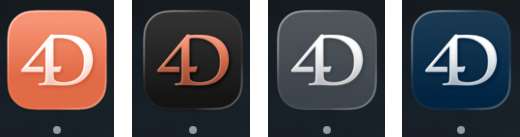

# TestAppIcon

This repository is a small app to test the new AppIcon behavior using Apple's [Icon Composer](https://developer.apple.com/icon-composer/).

## App icon source

- AppIcon package: [TestAppIcon/AppIcon.icon/](TestAppIcon/AppIcon.icon/)
  - The icon description lives in [`icon.json`](TestAppIcon/AppIcon.icon/icon.json): it defines the composition (gradient, effects, etc.) and references an SVG asset.
  - The referenced SVG is stored in the package assets: [`TestAppIcon/AppIcon.icon/Assets/4D.svg`](TestAppIcon/AppIcon.icon/Assets/4D.svg)

## Build outputs (observed)

- I think compiled asset catalog that appears to contain the AppIcon data for the Tahoe version of macOS:
  - `Build/TestAppIcon.app/Contents/Resources/Assets.car`
  - Using `acextract` only default theme is extracted, see [acextract/](acextract). It's an old tool. With other tools like [cartools](https://github.com/showxu/cartools) show some entries in catalog talking about grandient, color, IconGroup icon stack etc... and the svg
- Legacy `.icns` generated with only 16×16 and 128×128 variants (both 1× and 2×/Retina):
  - `Build/TestAppIcon.app/Contents/Resources/AppIcon.icns`

## Result

Preview of the app icon as it appears in the Dock:



## Generate using actool

`actool` seems to be able to generate build output

```bash
xcrun actool \
 --compile <outputdir> 
 --app-icon <outputIconName> \
 --platform macosx --minimum-deployment-target 10.13 \
 --notices --warnings --errors \
 --output-partial-info-plist ./actool.plist \
  <path/to/AppIcon.icon>
```
see [actool/](actool/) for generated output
